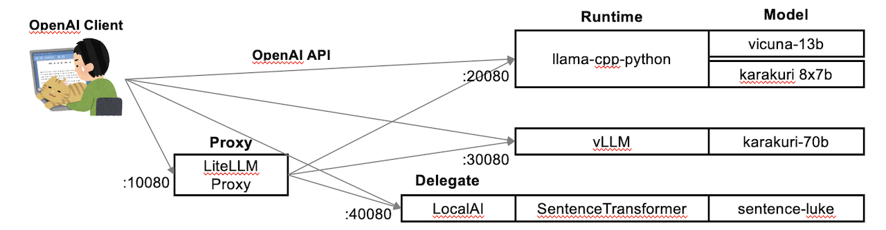

# LLM実行環境の構築

## [1. 実行環境](1.env/)
前提条件、設定項目、実行ユーザの作成

## [2. llama-cpp-python](2.llamacpp/)
GGUF形式のLLMをOpenAI互換サーバーとして起動する手順。

## [3. vLLM](3.vllm/)
16bit、GPTQ、AWQ形式のLLMをOpenAI互換サーバーとして起動する手順。

## [4. LocalAI](4.localai/)
SentenceTransformer(Embeddings)をOpenAI互換サーバーとして起動する手順。

## [5. LiteLLM](5.litellm/)
OpenAI互換プロキシとしてEndpointを一元化し、モデル名から該当サーバへ処理を割り振る手順。

## [6. GPTQ変換](6.gptq/)
Vicuna-13b-1.5の16bitモデルをGPTQ 8bitに変換する手順。

LLM実行委員会